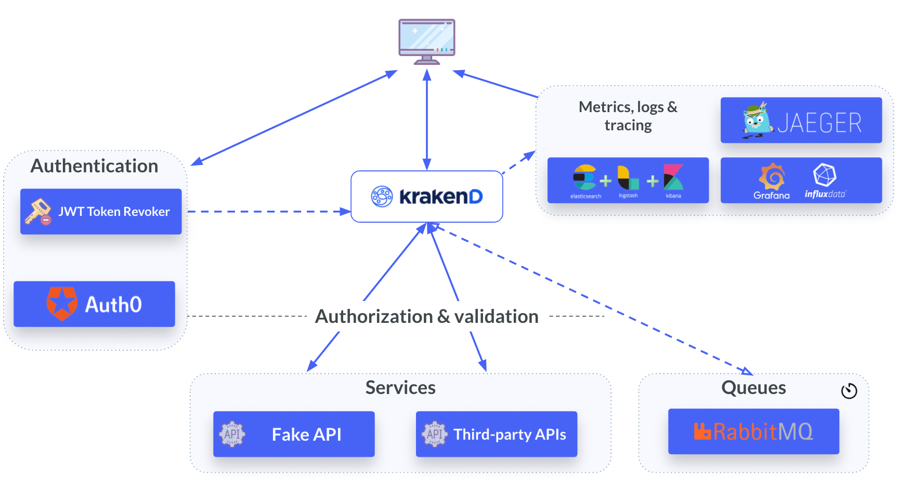
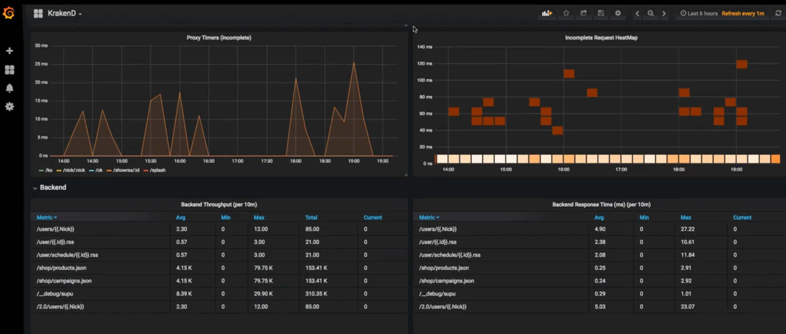
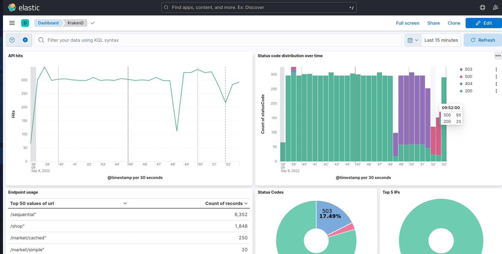
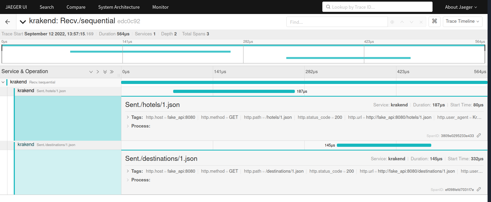

KrakenD Playground
====
The KrakenD Playground is a demonstration environment that puts together the necessary pieces to get you started with our API Gateway, using example use-cases.

As KrakenD is an API gateway, we have added surrounding services:

- Internal and third-party services that feed the gateway
- Authentication/authorization examples, including JWT token-based authentication with Auth0 integration, a JWT token revoker, API-Key-based authentication, and basic authentication.
- Integrations with Grafana+Influx (metrics), Jaeger (tracing) and RabbitMQ (for async agents).



## Demo video
Click to play on Youtube (with subtitles)

<a href="https://youtu.be/VtXXZRO84t8"></a>

## Services
The docker-compose.yml includes the following services:

### The API Gateway!
On port `8080`, you have an instance of KrakenD Enterprise Edition with several endpoints. Its configuration is available at `config/krakend/krakend.json`, including descriptive `@comments` for each endpoint.

Visit [http://localhost:8080/demo/](http://localhost:8080/demo/) where you'll find a [static website served by KrakenD](https://www.krakend.io/docs/enterprise/endpoints/serve-static-content/) itself.

### Fake API backend (Upstream)
On port `8000`, you have a simple fake API that provides raw data to the gateway. You can add or remove data by adding XML, JSON, or RSS files in the `data` folder.

It runs in [http://localhost:8000](http://localhost:8000)

### Metrics, logs & tracing
KrakenD can export telemetry to several services; this demonstration has a few examples. After starting the service and calling some endpoints, you will see the activity in Jaeger, Grafana, and Kibana.

| Metrics | Logging | Tracing |
| --- | --- | --- |
| **Grafana** shows the metrics stored by KrakenD on InfluxDB| **Kibana** shows the logs registered by Logstash and persisted in Elasticsearch | **Jaeger** shows the traces of the activity between the client and your end services, including times of hops.|
| URL: [http://localhost:4000](http://localhost:4000)| URL: [http://localhost:5601](http://localhost:5601) | URL: [http://localhost:16686](http://localhost:16686) |
||||

**NOTE**: To import a Kibana dashboard with some valuable metrics, run in the console the following command once all has started:

```shell
    $ make elastic
```

### Web client
This consumer of the API gateway is a simple Express JS application that interacts with KrakenD to fetch the data. All code is under `images/spa-auth-web/`.

The client is a Single Page Application using [Auth0](https://auth0.com) to generate JWT tokens.

**You don't need to install any npm locally**; the docker image will download and install the dependencies in the container.

Visit [http://localhost:3000](http://localhost:3000)

### The async agent
A RabbitMQ instance is ready to accept AMQP messages to be delivered to the gateway.

You can insert messages in the `krakend` queue at [http://localhost:15672/#/queues/%2F/krakend](http://localhost:15672/#/queues/%2F/krakend) (credentials: `guest`/`guest`) and see how the async agent picks them and delivers them.

### Metrics
A Jaeger dashboard shows the traces of the activity you generate. Runs on [http://localhost:16686](http://localhost:16686)

A Grafana dashboard shows the metrics of the activity you generate. Runs on [http://localhost:3003](http://localhost:3003) (credentials: admin/admin)

### The JWT revoker
A simple implementation of a JWT revoker using the KrakenD remote [bloomfilter client](https://github.com/krakendio/bloomfilter).

More information about JWT revoking is available at https://www.krakend.io/docs/authorization/revoking-tokens/

It runs on [http://localhost:9000](http://localhost:9000)

## Start the service

### Only if you want to try the Auth0 integration...
Create a new SPA application in [Auth0](https://manage.auth0.com/) and fill the autogenerated values they give you under `images/spa-auth-web/auth0-variables.js`

    var AUTH0_CLIENT_ID='AUTH0_CLIENT_ID';
    var AUTH0_DOMAIN='AUTH0_DOMAIN';
    var AUTH0_AUDIENCE = 'AUTH0_AUDIENCE';

**You must do this before starting the docker-compose.** If you have started docker-compose before setting these variables, you must build the image again with `docker compose build web`.

### Running the playground

To start the stack included in docker-compose
```shell
    $ make start
```

To follow the KrakenD logs after the complete stack is up & running
```shell
    $ make logs
```

To shut down the complete stack, removing all the volumes
```shell
    $ make stop
```

## Play!
Fire up your browser, curl, postman, httpie, or anything else you like to interact with any published services.

- Fake API: [http://localhost:8000](http://localhost:8000)
- KrakenD API Gateway: [http://localhost:8080](http://localhost:8080)
- Jaeger (tracing): [http://localhost:16686](http://localhost:16686)
- Kibana (logs): [http://localhost:5601](http://localhost:5601)
- Grafana (metrics): [http://localhost:4000](http://localhost:4000)
- Sample SPA for auth: [http://localhost:3000](http://localhost:3000)
- JWT revoker: [http://localhost:9000](http://localhost:9000)

When you change the `krakend.json`, the changes are applied automatically.

| 💡 Bonus track - Flexible configuration |
| --- |
| We've added an example of [flexible configuration](https://www.krakend.io/docs/configuration/flexible-config/), so you can view how it works in practice. <br><br> Apart from the default config file, `krakend.json`, you will find a `krakend-flexible-config.tmpl` that includes some code snippets, invokes a template using variables, and show some basic logic (iterations & conditions). <br><br> When working with the flexible configuration, you can optionally ask KrakenD to save the "compiled" output to a file. We've added a command `make compile-flexible-config` so you can see quickly and easily how KrakenD builds the final configuration file based on the existing templates.<br><br>Internally KrakenD's flexible configuration uses [Golang templating syntax](https://pkg.go.dev/text/template#hdr-Examples). |

## Editing the API Gateway endpoints
To add or remove endpoints, edit the file `krakend/krakend.json`. The easiest way to do it is by **dragging this file to the [KrakenD Designer](https://designer.krakend.io/)** and downloading the edited file. If you move the downloaded file to `krakend/krakend.json` the server will apply the changes automatically.

To change the data in the static server (simulating your backend API), edit, add or delete files in the **`data/`** folder.

The following endpoints are worth noticing:

| Feature                                       | Endpoint                                                        | Description                                                                                                                                                                      |
|-----------------------------------------------|-----------------------------------------------------------------|----------------------------------------------------------------------------------------------------------------------------------------------------------------------------------|
| Simple request                                | [`/public`](http://localhost:8080/public)                       | A simple request calling an internal service and returning a JSON response                                                                                                       |
| Data aggregation and manipulation             | [`/git/{user}`](http://localhost:8080/git/krakendio)            | Aggregating multiple calls concurrently and manipulating some data from GitHub API                                                                                               |
| Caching backend responses                     | [`/market/cached`](http://localhost:8080/market/cached)         | Caching a backend response (based on cache headers provided by the backend)                                                                                                      |
| Concurrent requests                           | [`/market/concurrent`](http://localhost:8080/market/concurrent) | Using [concurrent requests](https://www.krakend.io/docs/endpoints/concurrent-requests/) to gather data from Coingecko API                                                        |
| Sequential calls                              | [`/sequential`](http://localhost:8080/sequential)               | Using [sequential proxy](https://www.krakend.io/docs/endpoints/sequential-proxy/) to build a pipe of sequential calls, using values from 1st call response into 2nd call request |
| An aggregated requests with a failing backend | [`/fail`](http://localhost:8080/fail)                           | An example on how the `X-KrakenD-complete` header works when a backend fails on an aggregated response                                                                           |
| JWT based Authentication                      | [`/private/auth0`](http://localhost:8080/private/auth0)         | Protects and endpoint validating JWT tokens issued by Auth0                                                                                                                      |

You will find more examples with comments in `config/krakend/krakend.json`

## Contribute!
Everyone can get started with KrakenD at this repository.

Try it out! If it doesn't help you, or you think you can add additional endpoints or middleware integrations, please open a pull request! (We may be too used to KrakenD and don't recognize what a starter demo should include.)

Thanks!

---

If you have any questions or doubts, you can find our support resources at [https://www.krakend.io/support/](https://www.krakend.io/support/)

**Interested in a demo or a trial license of KrakenD Enterprise?** [Write us »](https://www.krakend.io/enterprise/#contact-sales)

---

_Note: if you're looking for the KrakenD Enterprise Edition Playground, you'll find it here: https://github.com/krakendio/playground-enterprise_
