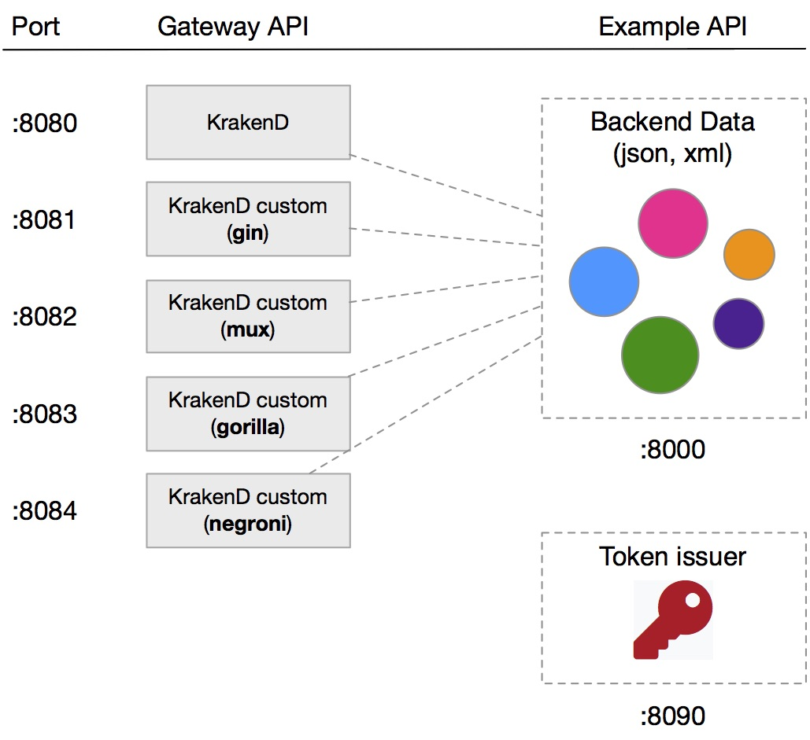

KrakenD Playground
====

The KrakenD Playground is a running environment with different versions of [KrakenD](http://wwww.krakend.io), commercial and [Open Source](https://github.com/devopsfaith/krakend), feeding from a demonstration API that you can change at your will.

You can expand this static API just by storing more XML or JSON files in the `data`
folder.

The KrakenD configuration is stored under `krakend/krakend.json` and you can
drag this file anytime to the [KrakenD designer](http://www.krakend.io/designer/) and resume the edition from there.

## Start!
In order to start all the services just run:

    docker-compose up

## Play!

Fire up your browser, curl, postman, httpie or anything else you like to interact with any of the following ports.

Different versions of KrakenD:

- Free version (based on commercial enterprise) runs in the port [8080](http://localhost:8080)
- Open source using **Gin** runs in the port [8081](http://localhost:8081)
- Open source using **Mux** runs in the port [8082](http://localhost:8082)
- Open source using **Gorilla** runs in the port [8083](http://localhost:8083)
- Open source using **Negroni** runs in the port [8084](http://localhost:8084)

The backend data ([LWAN](https://github.com/lpereira/lwan) server):

- All datasource endpoints under port [8000](http://localhost:8000)

If you use `docker-machine` you will need to access the services using something like `http://192.168.99.100:PORT` instead of `http://localhost:PORT`.

## Editing the endpoints
Initially the different KrakenD gateways present the following endpoint:

	http://localhost:8080/splash
	http://localhost:8081/splash
	http://localhost:8082/splash
	http://localhost:8083/splash
	http://localhost:8084/splash	

To add more, edit the file `krakend/krakend.json`, the easiest way is to **drag this file anytime to the [KrakenD designer](http://www.krakend.io/designer/)** and download the resulting file.

To change the data in the static server (simulating your backend) edit, add or delete files in the **`data`** folder. 
## Available demos

### KrakenD Free

This demo uses the [KrakenD free version](https://hub.docker.com/r/devopsfaith/krakend/), and is limited to 1000rps and 2 backend endpoints per KrakenD endpoint (if you add more they are ignored)

	$ curl -i http://${DOCKER_IP}:8080/splash

### OS KrakenD Gin

This demo uses the [Gin example](https://github.com/devopsfaith/krakend/blob/master/examples/gin/main.go) from the KrakenD OS

	$ curl -i -H'Host: ssl.example.com' http://${DOCKER_IP}:8081/splash

### OS KrakenD Mux

This demo uses the [Mux example](https://github.com/devopsfaith/krakend/blob/master/examples/mux/main.go) from the KrakenD OS

	$ curl -i -H'Host: ssl.example.com' http://${DOCKER_IP}:8082/splash

### OS KrakenD Gorilla

This demo uses the [Gorilla example](https://github.com/devopsfaith/krakend/blob/master/examples/gorilla/main.go) from the KrakenD OS

	$ curl -i -H'Host: ssl.example.com' http://${DOCKER_IP}:8083/splash

### OS KrakenD Negroni

This demo uses the [Negroni example](https://github.com/devopsfaith/krakend/blob/master/examples/negroni/main.go) from the KrakenD OS

	$ curl -i -H'Host: ssl.example.com' http://${DOCKER_IP}:8084/splash

## Add your demo endpoints and middleware integrations!

Do you want to add a new router? Just some other endpoints that might help others? Please sends a pull request!

Thanks!
